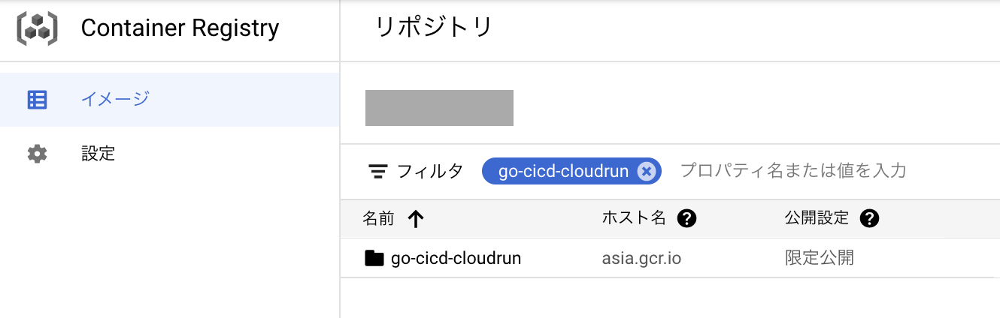
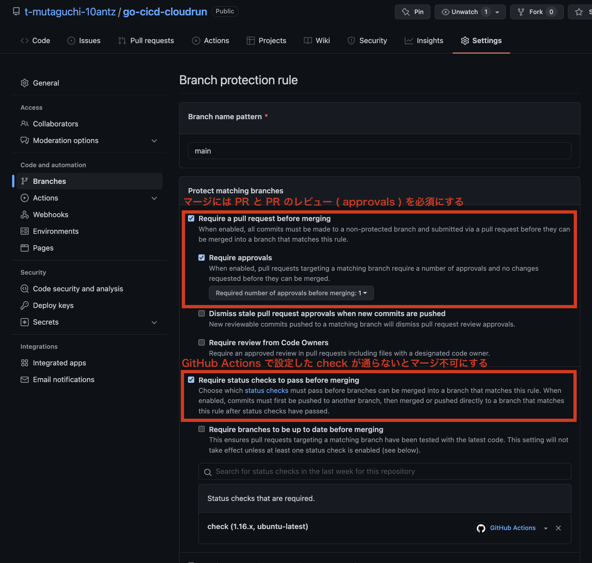
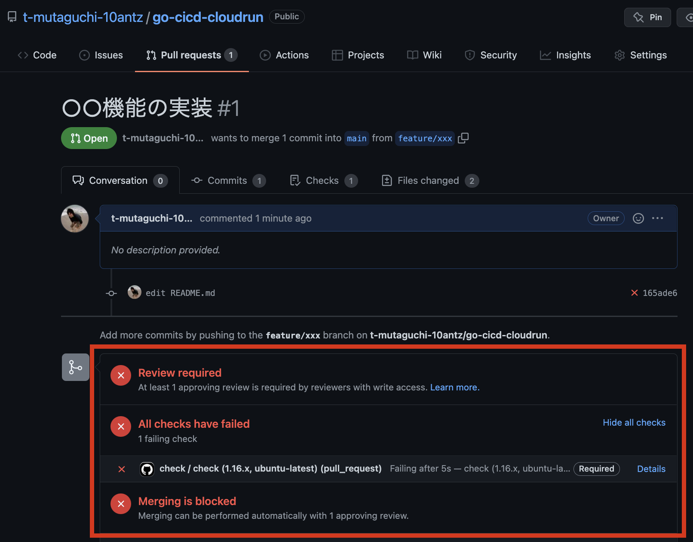

# CI/CD on Cloud Run

[](https://github.com/t-mutaguchi-10antz/go-cicd-cloudrun/actions)

# 目次

1. 前置
   1. 対象
   2. 用語
   3. 歴史・背景
2. 本題
   1. ローカルでの開発
   2. 実行環境への手動デプロイ
   3. デプロイの自動化 ( 継続的デリバリー / GitOps )
3. おまけ

# 1. 前置

## 1-1. 対象

個人だったりスタートアップといった小規模組織において、モノリシックでありながらもモダンな開発プロセスを構築したいというモチベーションを持つ方。

ビジネスが軌道に乗って、エンジニアリング組織の拡大・分割を行うフェーズの方は対象外。そういった方は、組織構成の検討と共に、Anthos などによるインフラの独自運用・マイクロサービス化を検討する必要がある。

弊社においても、これからそういうフェーズがくれば良いな、とは思うが、ビジネスが小規模なうちから十分な知見をもつエンジニアがいない中でマイクロサービス化を進めると、複雑化したシステム ( 分散トランザクションや分散トレーシングなど ) の開発、及び、運用を少人数で行う事になり、ビジネス成長のボトルネックにも成り得ると思う。

## 1-2. 用語

CI/CD 関連で頻出する用語の簡易説明。

### CI ( Continuous Integration ) - 継続的インテグレーション

機能追加や修正をメインブランチと頻繁に統合する手法。

統合までの時間が長くなるに従って差分も増え、問題が含まれるコードの特定や分離は難しくなるため、一回のマージ量を少なくする事で問題の発生を未然に防いだり、問題が発生した場合の特定を行い易くする事が目的。

### CD ( Continuous Delivery ) - 継続的デリバリー

CI を延長して、より高レベルの結合とテストなどを自動的に行い、追加・修正がリリース ( 本番環境へデプロイ ) 可能であることを保証する手法。

追加・修正はビルドやテストを実行した後、テスト環境またはステージング環境にデプロイして、システムテストや UI テストを行い、リリース準備ができた時点で、最後のステップとして本番環境へのデプロイを手動で行う。

### CD ( Continuous Deployment ) - 継続的デプロイ

継続的デリバリーを延長して、品質が保証されたソフトウェアのリリースまでを自動化する手法。

このプロセスでは確実にデプロイが実行されるように設計された実行環境のプロビジョニング、万が一のときにはアプリケーションをロールバックする自動化プロセスが用いられる。

|                            | Continuous<br>Integration | Continuous<br>Delivery | Continuous<br>Deployment |
| :------------------------- | :-----------------------: | :--------------------: | :----------------------: |
| テスト・ビルドの自動化     |             ✓             |           ✓            |            ✓             |
| 反復可能なデプロイプロセス |                           |           ✓            |            ✓             |
| 手動での承認を伴うリリース |                           |           ✓            |                          |
| 自動リリース               |                           |                        |            ✓             |

これらの用語は定義の境界が曖昧で、用いられるコンテキストに依っても意味が異なることもあるため、まとめて CI/CD と呼ばれる事が多い。

### DevOps

> 
> [cf. License](https://commons.wikimedia.org/wiki/File:Devops-toolchain.svg)

ソフトウェアを高品質・高頻度で市場投入する事を目的として、開発担当 ( Dev ) と運用担当 ( Ops ) がお互いの利害関係を超えて協力する文化・体制を指した混成語。

### The Twelve-Factor App

SaaS ( Software as a Service ) を作り上げるための方法論で、以下のような事が実現可能となる 12 のベストプラクティス集。

- セットアップ自動化のために宣言的なフォーマットを使い、プロジェクトに新しく加わった開発者が要する時間とコストを最小化する
- OS への依存関係を明確化し、実行環境間での移植性を最大化する
- モダンなクラウドプラットフォーム上へのデプロイに適しており、サーバー管理やシステム管理を不要なものにする
- 開発環境と本番環境の差異を最小限にし、アジリティを最大化する継続的デプロイを可能にする
- ツール、アーキテクチャ、開発プラクティスを大幅に変更することなくスケールアップできる

### GitOps

Git を中心とした運用に関する略語で 2017 年に Weaveworks 社が提唱したプロセス。

DevOps という用語に影響を受けているため語感が似ているものの、DevOps は文化・体制的な混成語であるのに対して GitOps は運用プロセス。概念の系統が異なるので混同しない事。

同時に以下のような用語も提唱されている。

| 用語        | 説明                                                 |
| :---------- | :--------------------------------------------------- |
| CIOps       | CI ツールを中心とした運用に関する略語                |
| Pull 型戦略 | 実行環境が必要な情報を取り込んでデプロイするプロセス |
| Push 型戦略 | CI ツールが主導となり実行環境にデプロイするプロセス  |
| Code Repo   | アプリケーションコードがホスティングされるリポジトリ |
| Config Repo | インフラの構成ファイルがホスティングされるリポジトリ |
| Image Repo  | コンテナリポジトリがホスティングされるリポジトリ     |

GitOps と CIOps の比較は以下の通り。

|              | GitOps                                         | CIOps                                                     |
| :----------- | :--------------------------------------------- | :-------------------------------------------------------- |
| 権限         | CI ツールと実行環境の分離                      | CI ツールに強い権限                                       |
| CD の中心    | Git                                            | CI ツール                                                 |
| 構成管理     | Config Repo で IaC (SSoT)                      | -                                                         |
| セキュリティ | 実行環境への接続情報が外部に出ないためセキュア | CI ツールが実行環境の接続情報を持つ点にセキュリティリスク |

今でこそ [CDF や CNCF でも取り扱われる議題](https://cd.foundation/blog/2021/03/23/gitops-summit-hosted-by-cd-foundation-and-cloud-native-computing-foundation/)となっている GitOps だが、2017 年の提唱当時は、従来の CI ツール ( Jenkins、CircleCI、Spinnaker など ) の問題点を提起し、自社製品を顧客にプロモーションしたいという Weaveworks 社のマーケティング的な背景もあったかと思う。そのまま鵜呑みにするのではなく、自分たちのビジネス規模や状況に於いて、最適なプロセス・ツールを選定する事が重要。

## 1-3. 歴史・背景

CI/CD に関する用語がどのように産まれてきたかを振り返る。

### 1991 年 - [オブジェクト指向分析と設計](https://www.amazon.co.jp/Booch%E6%B3%95-%E3%82%AA%E3%83%96%E3%82%B8%E3%82%A7%E3%82%AF%E3%83%88%E6%8C%87%E5%90%91%E5%88%86%E6%9E%90%E3%81%A8%E8%A8%AD%E8%A8%88-Professional-Grady-Booch/dp/4795296545) 初版

1990 年頃に[グラディ・ブーチ](https://ja.wikipedia.org/wiki/%E3%82%B0%E3%83%A9%E3%83%87%E3%82%A3%E3%83%BB%E3%83%96%E3%83%BC%E3%83%81)氏によって考案された Booch Method により CI ( Continuous Integration ) という用語が初めて提案された。

### 1995 年 - Windows 95 発売

PC が一般顧客にも普及、それに合わせてインターネットも急速に世の中へ浸透していき、市場投入のスピードが競争力のあるビジネス要因として求められるようになっていく。

### 1999 年 - [エクストリームプログラミング](https://www.amazon.co.jp/%E3%82%A8%E3%82%AF%E3%82%B9%E3%83%88%E3%83%AA%E3%83%BC%E3%83%A0%E3%83%97%E3%83%AD%E3%82%B0%E3%83%A9%E3%83%9F%E3%83%B3%E3%82%B0-%E3%82%B1%E3%83%B3%E3%83%88-%E3%83%99%E3%83%83%E3%82%AF/dp/4274217620) 初版

1990 年代後半に[ケント・ベック](https://ja.wikipedia.org/wiki/%E3%82%B1%E3%83%B3%E3%83%88%E3%83%BB%E3%83%99%E3%83%83%E3%82%AF)氏によって考案された XP では CI の概念を採用し、一日に複数回の統合を行うことを提唱した。

Booch Method の CI はそこまでの高頻度な統合を提唱していなかったが、XP によって CI は高頻度での統合を前提とした概念として浸透していく。

### 2010 年 - [継続的デリバリー](https://www.amazon.co.jp/%E7%B6%99%E7%B6%9A%E7%9A%84%E3%83%87%E3%83%AA%E3%83%90%E3%83%AA%E3%83%BC-%E4%BF%A1%E9%A0%BC%E3%81%A7%E3%81%8D%E3%82%8B%E3%82%BD%E3%83%95%E3%83%88%E3%82%A6%E3%82%A7%E3%82%A2%E3%83%AA%E3%83%AA%E3%83%BC%E3%82%B9%E3%81%AE%E3%81%9F%E3%82%81%E3%81%AE%E3%83%93%E3%83%AB%E3%83%89%E3%83%BB%E3%83%86%E3%82%B9%E3%83%88%E3%83%BB%E3%83%87%E3%83%97%E3%83%AD%E3%82%A4%E3%83%A1%E3%83%B3%E3%83%88%E3%81%AE%E8%87%AA%E5%8B%95%E5%8C%96-David-Farley/dp/4048707876) 初版

[デビッド・ファーリー](https://gotoams.nl/2021/speakers/1539/dave-farley)氏と[ジェズ・ハンブル](https://www.linkedin.com/in/jez-humble)氏の共著である本書にて Continuous Delivery という用語が市民権を得た。

本書の登場前は CI の文脈上でデプロイが語られる事も多かったが、本書で CD という用語が登場してからは、CI はテストやビルドなどの統合までを指す用語として用いられるように変遷してきている。

以上から、CI という用語の意味するものにデプロイを含める事が間違いとは言えないし、本書ではテスト・ビルドからデプロイまで一連のプロセスを Continuous Delivery として紹介しているため、CD はデプロイだけを指すものでもない。

### 2012 年 - [Model-Driven Engineering and the Impact of a Change](https://ieeexplore.ieee.org/document/6328202) 初出？

Continuous Deployment を専門に取り扱った書籍はないが、IEEE という研究用データベースには、タイトルの文書を含め、Continuous Deployment という用語が使用されている文書がいくつか登録されている。

### 2017 年 - [Guide to GitOps](https://www.weave.works/technologies/gitops/)

Weaveworks 社 CEO [アレクシス・リチャードソン](https://uk.linkedin.com/in/richardsonalexis)氏が提唱。

氏は過去に Spring、RabbitMQ、Redis、Tomcat、vFabric などの製品責任者を務めた実績があり、CNCF の [TOC](https://github.com/cncf/toc) 議長も務めているため、クラウドネイティブ業界での影響力は大きい。

> TOC / Technical Oversight Committee
> 
> CNCF の技術的な管理機関、CNCF の全てのプロジェクトを承認・監督すると共に、中立的なコンセンサスを促進することが使命。

---

技術用語は産まれたばかりの用語で定義が固まっていない事も多く、また、数年のうちに定義が変わっていく事もありえる。

 ユビキタス言語が注目されるように用語の意味を明確に定義する事は重要であるものの、その言葉が用いられているコンテキストから、その用語で何を表現したいのかを汲み取る事も重要。

# 2. 本題

## 2-1. ローカルでの開発

HTTP サーバーの機能を持つアプリケーションをどのように実装、コンテナ化すべきかを説明。

### 要点

サーバーをコンテナ化する上では、そのコンテナイメージが実行環境において、どのように起動・終了するのか ( ライフサイクル ) を想定した実装を行う必要がある。

### ソリューション

| 項目               | ソリューション |
| :----------------- | :------------- |
| プログラミング言語 | Go             |
| Code Repo          | GitHub         |
| コンテナイメージ   | Docker         |

以下の環境が必要。

- [必須] Go
- [必須] GitHub アカウント
- [必須] Docker Engine
- [任意] direnv

今回のアプリケーションコード ( Code Repo ) は [github.com/t-mutaguchi-10antz/go-cicd-cloudrun](https://github.com/t-mutaguchi-10antz/go-cicd-cloudrun) にホスティングしているので、以下のように前準備を行う。

```bash
$ git clone git@github.com:t-mutaguchi-10antz/go-cicd-cloudrun.git
$ cp .env.default .env
```

### 2-1-1. Go アプリケーション

プログラムは [server.go](https://github.com/t-mutaguchi-10antz/go-cicd-cloudrun/blob/main/cmd/server/server.go) から閲覧可能なため、以下は要点に絞って説明。

#### Health Check

コンテナの状態を示すエンドポイントを実行環境に提供する。

実行環境側にエンドポイントを指定する事で、実行環境はポーリングに依る死活監視 ( レスポンスに応じてコンテナをサービスイン・アウト ) を行う。

Kubernetes なら Deployment で Readiness/Liveness Probe の設定を行う。Cloud Run ではヘルスチェックのエンドポイントは設定できないため、一定数のエラーをユーザーにレスポンスする事を許容した上で採用する。

```go
mux.HandleFunc("/healthy", func(w http.ResponseWriter, r *http.Request) {
  // サーバーが依存するミドルウェア ( e.g. データベース ) との接続が通っていないなどの理由により、
  // このアプリケーションがサービスを提供できない場合は 200 OK 以外のステータスを返す、など
  dbAvailable := true
  if dbAvailable {
    w.WriteHeader(http.StatusOK)
  } else {
    w.WriteHeader(http.StatusInternalServerError)
  }
})
```

#### Graceful Shutdown

負荷減によるスケールインなどで実行環境がコンテナへ終了信号を通知した場合でも、コンテナ側では処理中のリクエストに対してレスポンスを行った上で安全に終了する必要がある。

```go
// 実行環境からの信号を受信するチャンネル
//
// - SIGTERM
//   プロセスを正常終了する場合に送られる信号 ( e.g. kill $pid / スケールインなどにより k8s が pod を終了する場合 )
//
// - SIGINT
//   プロセスを中断する場合に送られる信号 ( e.g. Ctrl + c )
//   os.Interrupt は SIGINT のエイリアス
//
// - SIGKILL
//   プロセスを強制終了する場合に送られる信号 ( e.g. kill -9 $pid / k8s が SIGTERM を送った後、猶予期間が経過しても pod が終了していない場合 )
//   即時終了させる必要があるため Graceful Shutdown は行わない
//   os.Kill は SIGKILL のエイリアス
// 
sig := make(chan os.Signal, 1)
signal.Notify(sig, syscall.SIGTERM, syscall.SIGINT)

// サーバーのゴルーチンにおいて ListenAndServe() で ErrServerClosed 以外のエラーが発生した場合、
// 信号の監視を中断するために使われるチャンネル
cancel := make(chan struct{})

// 信号を監視するゴルーチン
g.Add(
  func() error {
    select {
    case <-sig:
    case <-cancel:
    }
    return nil
  },
  func(err error) {
    close(cancel)
  },
)

// サーバーのゴルーチン
g.Add(
  func() error {
    log.Infof("start serving on %s", srv.Addr)

    if err := srv.ListenAndServe(); err != http.ErrServerClosed {
      log.Errorf("failed to serve: %v", err)
      return fmt.Errorf("failed to serve: %w", err)
    }

    return nil
  },
  func(err error) {
    log.Infof("gracefully shutting down...")

    // リクエストを受けている場合でも、指定時間は待って安全に終了させる
    ctx, cancel := context.WithTimeout(context.Background(), gracefulDuration)
    defer cancel()

    if err := srv.Shutdown(ctx); err != nil {
      log.Fatalf("forced shutdown: %+v", err)
    }

    log.Infof("graceful shutdown")
  },
)

// 監視とサーバーのゴルーチンいずれかでエラーが発生した場合、エラーステータスで終了する
if err := g.Run(); err != nil {
  os.Exit(1)
}
```

ゴルーチンの制御に使用している [oklog/run](https://github.com/oklog/run) パッケージの説明は割愛。

ローカル環境では、ユニットテスト＆ビルドで実装を進める。

```bash []
# プリミティブな方法

## ユニットテスト
$ go test -v ...
## ビルド
$ go run cmd/server/server.go
--
INFO[0000] start serving on 0.0.0.0:8080


# Makefile を活用した方法

## 周辺ツールのインストール
$ make install

## Lint & ユニットテスト & カバレッジレポート
$ make check

## ライブリロード
$ make air
```

動作確認を行う。

```bash []
$ curl http://localhost:8080
Hello! RequestID: 62241ee2-8924-4cd7-ad31-ce93773126b7
```

サンプルコードでは、Graceful Shutdown の猶予は 10 秒、リクエストを受けてからレスポンスを返すまでは 5 秒スリープを入れており、Graceful Shutdown を実装しているため、アクセス中にサーバーを `Ctrl + C` ( or `$ kill $pid` ) しても、レスポンスを返してから終了する事が確認できる。

### 2-1-2. Docker イメージの作成

開発したアプリケーションは以下のようにコンテナイメージにビルトインする。

```dockerfile [1-20|1-13|16-20]
# Stage 1: Go アプリのビルド

FROM golang:1.16 as builder
WORKDIR /workspace
COPY . .

## Go が参照するパッケージに GitHub のプライベートリポジトリが存在しても認証されるように設定
ARG GITHUB_TOKEN
RUN git config --global url."https://$GITHUB_TOKEN@github.com/".insteadOf "https://github.com/"
## Golang 製アプリのビルド
RUN CGO_ENABLED=0 GOOS=linux GOARCH=amd64 go build -o /server -ldflags '-s -w' cmd/server/server.go


# Stage 2: アプリをセキュアなディストリビューションに移動

FROM gcr.io/distroless/static-debian10
COPY --from=builder /server /server
ENTRYPOINT ["/server"]
```

[Sysdig 社が公開している Dockerfile のベストプラクティス](https://sysdig.jp/blog/dockerfile-best-practices/)として、distroless image を使うことが推奨されている。

GitHub でパーソナルアクセストークンを発行。権限は `repo` のみで OK。


.env に環境変数を設定。

```bash []
SERVICE=go-cicd-cloudrun
GITHUB_TOKEN=ghp_xxx
```

イメージをビルド後、実行。

```bash
$ docker build . -t $SERVICE --build-arg GITHUB_TOKEN=$GITHUB_TOKEN
$ docker run -p 80:8080 --rm --env-file .env --name $SERVICE $SERVICE
```

動作確認を行う。

```bash []
$ curl http://localhost
Hello! RequestID: 081dfd33-875b-41bb-a9a8-fb9c7f8c57c9
```

## 2-2. 実行環境への手動デプロイ

アプリを実行環境に手動でデプロイする。

### ソリューション

| 項目                     | ソリューション                    |
| :----------------------- | :-------------------------------- |
| Code Repo                | GitHub                            |
| Image Repo               | Google Container Registry ( GCR ) |
| 高い可用性をもつ実行環境 | Cloud Run                         |

以下の環境が必要。

- [必須] GCP アカウント
- [必須] GCP Cloud SDK ( gcloud )

本記事ではテスト環境や本番環境はまとめて実行環境としているため、実際のプロジェクトでは必要に応じて環境を用意すること。

まずは GCP の設定を行う。

```bash []
# GCP へログイン
$ gcloud auth login

# docker の認証情報に GCR を設定
$ gcloud auth configure-docker

# GCR と Cloud Run を有効化
$ gcloud services enable containerregistry.googleapis.com run.googleapis.com
```

> 22.02.23 現在、Container Registry ではなく Artifact Registry の利用が推奨されているため、移行を推奨

.env に環境変数を設定。

```bash []
GCP_PROJECT=xxx
SERVICE=go-cicd-cloudrun
IMAGE_URL=asia.gcr.io/$GCP_PROJECT/$SERVICE

GITHUB_TOKEN=ghp_xxx
```

Docker イメージをビルド。

```bash []
$ docker build . -t $IMAGE_URL:0.0.1 --build-arg GITHUB_TOKEN=$GITHUB_TOKEN
```

GCR へプッシュ。

```bash []
$ docker push $IMAGE_URL:0.0.1
```



Cloud Run へデプロイ。

```bash []
$ gcloud run deploy $SERVICE --image $IMAGE_URL:0.0.1 --region asia-northeast1
# 本来は認証などの設定を行うが、今回は認証不要なので y にする
Allow unauthenticated invocations to [go-cicd-cloudrun] (y/N)? y ⏎
```


動作確認を行う。

```bash []
$ curl https://go-cicd-cloudrun-xxx-an.a.run.app/
Hello! RequestID: 1e259968-3b0b-4284-9933-a0e9e12a8886
```

## 2-3. デプロイの自動化 ( 継続的デリバリー / GitOps )

手動リリースを GitOps といわれる CI/CD プロセスに切り替える。

### ソリューション

| 項目             | ソリューション                                  |
| :--------------- | :---------------------------------------------- |
| テスト           | GitHub Actions                                  |
| ビルド           | Cloud Build                                     |
| Config Repo      | Cloud Build ( マネージドなので意識しなくて OK ) |
| 承認型のリリース | GitHub Actions & Cloud Build                    |

GitHub Actions からのリリースも可能だが、それだと実行環境外に認証情報を持つため CIOps ( Push 型戦略 ) になる。すなわち GitHub に GCP の認証情報を持たせる事になり、セキュリティリスクが GitOps ( Pull 型戦略 ) より高くなる。

まずは GCP の設定を行う。

```bash []
# GCP へログイン
$ gcloud auth login

# Cloud Build を有効化
$ gcloud services enable cloudbuild.googleapis.com
```

### 2-3-1. GitHub の設定

Cloud Build 側から Code Repo リポジトリにシークレットを登録する。

1. Cloud Build 用の GitHub アカウントを作成
2. そのアカウントでパーソナルアクセストークンを発行
3. リポジトリのシークレットに `ACCESS_TOKEN` という名前で登録


Git リポジトリの運用手法においては以下のルールで GitHub Actions を設定する。

- チェックは Lint とユニットテストを実施する
- `main` ブランチへプッシュするとチェックが起動する
- `v*` タグをプッシュするとチェックが起動する ( 本記事では本番環境は用意しない )

```yaml
name: check
on:
  push:
    branches:
      - main
    tags:
      - v*
  pull_request:
jobs:
  check:
    name: check
    strategy:
      matrix:
        go-version: [1.16.x]
        os: [ubuntu-latest]
    runs-on: ${{ matrix.os }}
    steps:
      - name: Checkout code
        uses: actions/checkout@v2

      - name: Set up Go
        uses: actions/setup-go@v2
        with:
          go-version: ${{ matrix.go-version }}

      - name: Configure git for private modules
        env:
          ACCESS_TOKEN: ${{ secrets.ACCESS_TOKEN }}
        run: git config --global url."https://${ACCESS_TOKEN}@github.com".insteadOf "https://github.com"

      - name: Get dependencies
        run: go get -v -t -d ./...

      - name: Lint
        uses: golangci/golangci-lint-action@v2
        with:
          version: latest

      - name: Unit test
        run: go test -v ./...
```

この yaml を Code Repo の `.github/workflows` 配下に設置する事で、GitHub Actions が設定される。

GitHub のブランチ保護設定を以下のように行う。



`feature/xxx` ブランチから `main` ブランチに PR を送ると、ステータスが表示されるようになっている。設定に基づき、チェックが通らないとマージできない事が確認できる。



レビューとチェックを通過すれば、マージが可能になる。


### 2-3-2. Cloud Build の設定

Cloud Build のトリガー設定を行う、初期設定は Cloud Run 側から行う。


この時、Cloud Build 用に作成した GitHub アカウントの登録などを行う。

#### トリガー設定 - 2

Cloud Build 側のトリガー設定では以下のように設定する。


#### トリガー設定 - 3

Cloud Build の VM 上からプライベートリポジトリへアクセスできるよう、`--build-arg` の設定を追加する。


```
- "--build-arg"
- "GITHUB_TOKEN=$_GITHUB_TOKEN"
```

#### トリガー設定 - 4

上述のビルドオプションに渡す環境変数を設定する。


必要な設定は以上で完了、GitHub で PR のマージを行うと Cloud Run へのデプロイが行われる事を確認する。

#### 環境変数を設定

The 12 Factor App に従い、アプリケーション実装時に環境変数を使うようにしておけば、実行環境に依る変数は Cloud Run 側の設定で変更が可能。


---

ここまでの工程を終えれば、実行環境の認証情報を GitHub に持たせる事なく、Code Repo を中心とした GitOps を実践可能となる。

本番環境を含む実運用の際、本記事では以下が不足しているので、考慮する事。

| 項目                        | ソリューション                                                                                                                                                                                                                                                               |
| :-------------------------- | :--------------------------------------------------------------------------------------------------------------------------------------------------------------------------------------------------------------------------------------------------------------------------- |
| E2E テスト                  | 統合環境へマージする際、API に対してシナリオに沿ったテストなどが行えると良い。                                                                                                                                                                                               |
| 本番環境の GCP プロジェクト | GCP ではプロジェクト単位で権限を設計する事が望ましいため、統合環境と本番環境のプロジェクトは別にする。                                                                                                                                                                       |
| 認証・認可                  | 前段に Cloud Load Balancing & Cloud Armor を設置して IP 制限を行うことも可能だが、モダンな手法としてはゼロトラストが注目されているため、[GCP API Gateway](https://cloud.google.com/api-gateway) と連携して JWT Token を使った OpenID Connect ( OAuth2 ) の仕組みを導入する。 |
| DDoS 保護                   | GCP のサービスは全て Google Front End を経由するためあまり神経質にならなくても良いかとは思う。厳密に行う必要があれば、前段に Cloud Load Balancing & Cloud Armor を設置する。また、[API Gateway のレート制限](https://cloud.google.com/api-gateway/docs/quotas)を活用する。   |

GCP のセキュリティについては、GCP 公式パートナーである TopGate さんの[ゼロからわかる！GCPのネットワークセキュリティの全体像](https://www.topgate.co.jp/google-cloud-network-security)を一読すると良い。


# 3. おまけ

## 3-1. GCP の活用

GCP だとどんなメリットがあるのか、Cloud Run の場合を紹介。

### 3-1-1. Cloud Logging


- HTTP(S) サーバーであれば、標準でアクセスログを出力
- アプリケーションログも出力可能
- 出力を JSON 形式にしておけば、独自の付属データを含める事も可能
  - ログの設計次第で、BigQuery を介しての分析用途としても使用可能

### 3-1-2. Cloud Monitoring


- CPU 使用率といった指標は標準で閲覧可能
- 指標を元にしたアラートも設定可能
  - 通知先はメール / SMS / PagerDuty なども対応

## 3-2. コンテナの将来

コンテナといえば Docker イメージが標準的だが、将来的には別の選択肢も出てくる。

### 3-2-1. Open Container Initiative ( OCI )


コンテナのフォーマット・ランタイムの業界標準策定を目的として設立された団体で Linux Foundation プロジェクトの 1 つ。

OCI で作成された標準を元に、Kubernetes 上で WebAssembly を動作させる [Krustlet というソフトウェアが 2021 年 8 月に CNCF Sandbox に採択](https://www.cncf.io/blog/2021/08/05/cloud-native-webassembly/)されており、近い将来、言語の垣根無く気軽に高可用な実行環境が利用できるようになる。

## 3-3. 終わりに

本記事が皆さまのお役に立てば幸いです。

